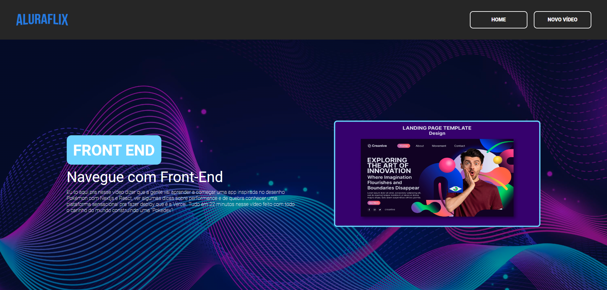

<h1> AluraFlix 🍿 </h1>

O Aluraflix é uma plataforma inspirada no Netflix, voltada para a educação. Seu objetivo é sugerir vídeos relacionados aos interesses educacionais dos usuários, organizados em categorias personalizáveis. Além de explorar os vídeos sugeridos, você pode adicionar novas categorias e vídeos, tornando a plataforma adaptável às suas necessidades de aprendizado.

## :dizzy: Tecnologias utilizadas

  
  
  
  
  
  

## :computer: Visão Geral do Projeto

### Interface do Usuário

## :hammer: Caracteristicas

- `Botão:` Componente reutilizável para ações como submissão de formulários e navegação.

- `Header:` O cabeçalho da aplicação, contendo a navegação principal e a identidade visual do Aluraflix.

- `Banner:` Um destaque visual que apresenta conteúdos importantes ou novidades na plataforma.

- `Footer:` O rodapé da aplicação, que pode incluir informações de contato, links úteis e outras informações relevantes.

- `Página Padrão:` Estrutura base para todas as páginas da aplicação, garantindo consistência no layout e na experiência do usuário.

## :mag: Demonstração

Para uma experiência completa e visual do projeto em funcionamento, você pode acessar a demonstração interativa do projeto, [clique aqui.](https://alura-flix-eight-ashy.vercel.app/)

## :open_file_folder: Como Utilizar

1. Clone o repositório em seu ambiente de desenvolvimento.
2. Abra o arquivo index.html em seu navegador preferido.

## :student: Autor

Este repositório contém o projeto Aluraflix, desenvolvido como o desafio final para a formação no curso proporcionado pela Oracle em parceria com a Alura.
